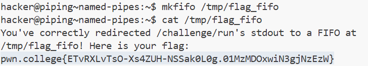
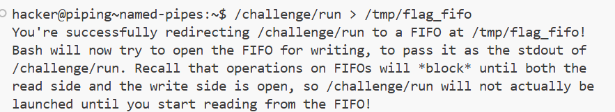

# Challenge 14 : Named Pipes

Developed an understanding of making of named pipe and its working

## My solve

**Flag:** pwn.college{ETvRXLvTsO-Xs4ZUH-NSSak0L0g.01MzMDOxwiN3gjNzEzW}

What I Learnt: Calling commands using fifos

- In terminal A ran the read operation for named pipe which had been subsequently blocked while in terminal B the write operation for the pipe was executed and then simultaneously the result in terminal A was received

```


```

Incorrect Tangents :
None

References :
None
